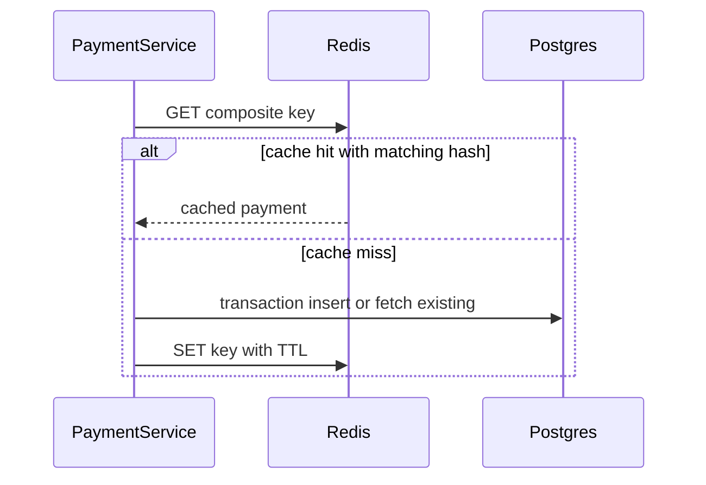

# Phase 3: Redis Idempotency Cache

## What changed

- Added Redis client in `src/db/redis.ts`.
- Added `RedisIdempotencyCache` in `src/repositories/RedisIdempotencyCache.ts`.
- Updated `PaymentService.createPayment` to check Redis before Postgres.
- Cache key format: `idempotency:{customerId}:{idempotencyKey}`.
- Cache value stores `{ payment, requestHash }` for conflict detection on cache hits.
- Write-through cache on successful payment creation with TTL from `IDEMPOTENCY_TTL_SECONDS`.

## Why

Idempotency lookups happen on every `POST /payments`. Redis reduces Postgres read load and improves latency for repeated retries with the same key.

## Flow



## How to verify

```bash
docker compose up -d redis
# First request: fromCache false
# Immediate retry with same key: fromCache true (served via Redis/Postgres)
```

Use `redis-cli GET idempotency:cust_1:your-key` to inspect cached entries.
